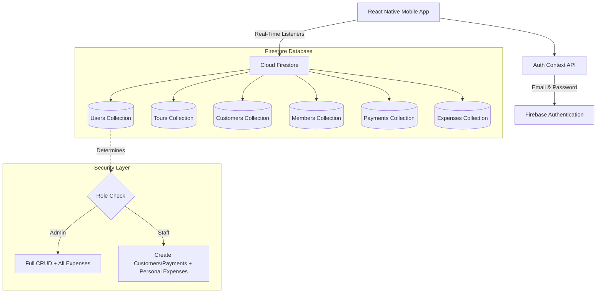

# 🌍 Tour Expense Manager

[](https://www.typescriptlang.org/)
[](https://reactnative.dev/)
[](https://expo.dev/)
[](https://firebase.google.com/)
[](https://opensource.org/licenses/MIT)

A premium, role-based tour group and financial management mobile application built with **React Native**, **TypeScript**, and **Firebase**. Designed to empower travel agencies, tour operators, and field staff with real-time tracking of customers, payments, group members, and on-trip expenses.

---

## 🗺️ System Overview & Architecture

The application implements a secure **Role-Based Access Control (RBAC)** architecture that splits users into **Admin** and **Staff** roles. It leverages **Cloud Firestore** for real-time offline-first database synchronization and integrates strict server-side rules for data security.



---

## ✨ Features & Role-Based Access Control

### 🔐 Multi-Role User Authentication
Secure login using Firebase Authentication. Upon authentication, user profiles are cross-referenced with Firestore to establish their operational scope:
*   **Admin Access**: Full ecosystem control.
*   **Staff Access**: High-performance operational workflow with scoped permissions.

### 👑 Admin Workspace Capabilities
*   **Tour Management**: Create, view, update, and cascade-delete tour packages (destinations, pricing, default settings).
*   **Cascading Deletes**: Robust batch transaction deletion using Firestore's `writeBatch`. Deleting a tour automatically sweeps and deletes all associated customers, group members, payment logs, and registered expenses to prevent orphaned documents.
*   **Global Financial Audits**: View all compiled expenses across all staff and tours, with full permissions to delete or adjust records.
*   **Customer & Group Tracking**: Oversee registrations, calculate totals paid, and manage individual participant rosters.

### 💼 Staff / Field Agent Capabilities
*   **On-Trip Expense Tracking**: Add, view, and modify personal on-trip expenses. Staff can only access and view expenses recorded by themselves for security.
*   **Passenger Onboarding**: Add customer files, define their traveling companions/family members, and update payment figures.
*   **Real-time Ledger Sync**: Log dynamic payment entries instantly when onboarding travelers in the field.

---

## 🛠️ Technical Architecture & Quality Assurance

*   **100% Type-Safe Codebase**: Migrated from legacy JS to TypeScript, securing high-integrity interfaces for all core entities (Tours, Customers, Members, Payments, and Expenses).
*   **Optimized Firestore Queries**: Employs locally managed sort indices to present real-time records safely without creating expensive composite index configurations.
*   **Cascading Transactions**: Implements Firestore `writeBatch` commands for atomicity, ensuring data transitions execute fully or rollback safely upon network interruption.

---

## 🏗️ Folder Structure

The project features a highly modular, clean folder hierarchy, keeping components, context, services, and styling systems completely segregated for maximum maintainability:

```text
sltet/
├── assets/                  # Application icons, splash screens, and images
├── src/
│   ├── api/                 # Firestore services & backend interaction layer
│   │   ├── firebaseConfig.ts# Core Firebase client init
│   │   ├── tourService.ts   # Tour subscriptions and cascade deletion batch logic
│   │   ├── expenseService.ts# Role check query builder & expense ledgers
│   │   ├── customerService.ts# Customer roster & payment registration
│   │   ├── memberService.ts # Customer co-traveler registries
│   │   └── paymentService.ts# Individual client ledgers
│   ├── components/          # Reusable UI component blocks (Buttons, Inputs, Spinners)
│   ├── context/             # Authentication & Global Session state providers
│   ├── navigation/          # React Navigation stacks (Admin vs. Staff route isolation)
│   ├── screens/             # UI views segregated by target audience
│   │   ├── Auth/            # Login and verification screens
│   │   ├── Admin/           # Tour builder, comprehensive registers, and global financial overviews
│   │   ├── Staff/           # Staff dashboard, scoped expense entry, and customer forms
│   │   └── Shared/          # Reusable customer profiles and payment list boards
│   ├── theme/               # Centralized Design Tokens (colors, fonts, sizes)
│   └── types/               # System-wide static TypeScript interfaces
├── .env.example             # Clean environment variables blueprint
├── App.tsx                  # Root entry point initializing global Providers
├── app.json                 # Expo configurations (Bundlers, Assets, Plugins)
├── firestore.rules          # Strict Cloud Firestore database security definitions
└── tsconfig.json            # Rigid TypeScript compile-time constraints
```

---

## 📦 Tech Stack & Dependencies

*   **Frontend Mobile Core**: [React Native](https://reactnative.dev/) & [Expo (SDK 54)](https://expo.dev/)
*   **Programming Language**: [TypeScript](https://www.typescriptlang.org/)
*   **Database & Auth Engine**: [Cloud Firestore](https://firebase.google.com/docs/firestore) & [Firebase Auth](https://firebase.google.com/docs/auth)
*   **Interface Iconography**: [Lucide React Native](https://lucide.github.io/lucide-react/)
*   **Layout Navigation Stacks**: [React Navigation (Native Stack)](https://reactnavigation.org/)
*   **Visual Enhancements**: [Expo Linear Gradient](https://docs.expo.dev/versions/latest/sdk/linear-gradient/)
*   **Object Validation**: [Zod](https://zod.dev/)

---

## ⚙️ Local Development Setup

To replicate the project locally and begin development, ensure you have the following installed:
*   [Node.js (v18 or higher)](https://nodejs.org/)
*   [Git](https://git-scm.com/)
*   Expo Go app on iOS/Android (for testing) or a local emulator (Xcode/Android Studio)

### 1. Clone & Navigate
```bash
git clone https://github.com/your-username/your-repo-name.git
cd your-repo-name
```

### 2. Install Project Dependencies
```bash
npm install
```

### 3. Setup Local Environment Variables
Create a `.env` file at the root of the project directory (use `.env.example` as a reference):
```env
EXPO_PUBLIC_FIREBASE_API_KEY=AIzaSyA1...
EXPO_PUBLIC_FIREBASE_AUTH_DOMAIN=your-app.firebaseapp.com
EXPO_PUBLIC_FIREBASE_PROJECT_ID=your-app-id
EXPO_PUBLIC_FIREBASE_STORAGE_BUCKET=your-app.appspot.com
EXPO_PUBLIC_FIREBASE_MESSAGING_SENDER_ID=1234567890
EXPO_PUBLIC_FIREBASE_APP_ID=1:12345:web:abcd
```
> [!NOTE]
> All keys prefixed with `EXPO_PUBLIC_` are automatically packaged into the client bundle at build-time by Expo's bundler.

### 4. Setup Firestore Security Rules
Deploy the rules from `firestore.rules` to your Firebase project. In your Firebase Console, navigate to **Firestore Database** -> **Rules** and paste the code from `firestore.rules`.

### 5. Launch the Development Server
```bash
npx expo start
```
*   Press `a` to run on an Android emulator/device.
*   Press `i` to run on an iOS simulator/device.
*   Scan the QR code in your Expo Go app to launch on a physical device.

---

## 🔒 Firebase Security Protocols

We implement server-side validation using **Cloud Firestore Security Rules** to lock down the database. Even if client-side validation is bypassed, illegal operations will fail on Firestore:

*   **Tours Collection**: Accessible to read by any authenticated member. Strict write parameters allow **only** verified `admin` profiles to create, modify, or delete a tour block.
*   **Expenses Collection**: Authenticated staff members can compile personal expenses. Reads are strictly mapped (`isAdmin() || resource.data.userId == request.auth.uid`) so staff can never access expenses logged by others. Only admins possess global read, edit, and deletion privileges.
*   **Atomic Batch Controls**: Batch updates prevent orphan documents, maintaining strong structural integrity across the system.

---

## 📱 User Interface & Visuals

Here is a visual overview of the application flow. 

| Role Selection / Auth | Admin Tour List | Expense Manager | Customer Board |
| :---: | :---: | :---: | :---: |
|  |  |  |  |

*(To host screenshots: create a `/assets/screenshots` folder in your repo, upload your images, and update the URLs above!)*

---

## 🚀 Future Roadmap & Enhancements

- [ ] **Offline Synchronization**: Implement local offline database caching (SQLite or Firestore offline persistence) to support on-field usage in remote regions with weak cellular coverage.
- [ ] **Push Notifications**: Expo Notification Server integration to alert administrators immediately when expenses are registered, and notify staff when a tour is modified.
- [ ] **Automated PDF & CSV Ledger Exporter**: One-click generation of beautifully formatted travel roster lists and financial statements ready to be shared with accounting teams.
- [ ] **Advanced Data Analytics Dashboard**: Graphical representation of profitability, cost breakdowns, and staff expenditure using chart libraries.

---

## 📄 License

This project is licensed under the MIT License - see the [LICENSE](LICENSE) file for details.
